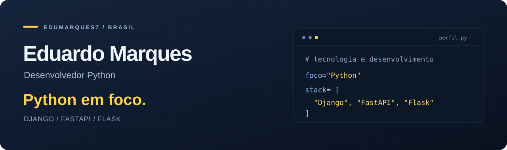

  
  
  

  

## Sobre mim

Sou **Eduardo Marques**, desenvolvedor Python no Brasil.

Meus estudos e projetos têm foco em **Python e desenvolvimento web**, com Django, FastAPI e Flask. Estou construindo minha base técnica e ampliando meus conhecimentos em bancos de dados e ferramentas de desenvolvimento.

## Ecossistema principal

## Outras tecnologias nos meus estudos

| Desenvolvimento | Dados | Ferramentas e infraestrutura |
| :--- | :--- | :--- |
| Ruby · Ruby on Rails | PostgreSQL | Docker |
| JavaScript | MySQL | Postman · VS Code |
| HTML5 | SQLite | Heroku |

## Atividade no GitHub

  
  

---

### Vamos conversar?

Para falar sobre projetos, tecnologia ou oportunidades profissionais, me encontre no [LinkedIn](https://www.linkedin.com/in/eduardo-marques-barbosa-27a6b3272/) ou escreva para **[marques.barbosa64@gmail.com](mailto:marques.barbosa64@gmail.com)**.
